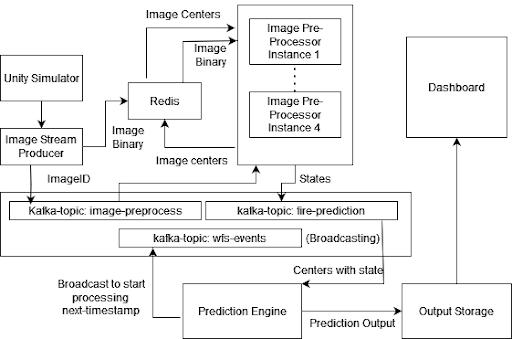
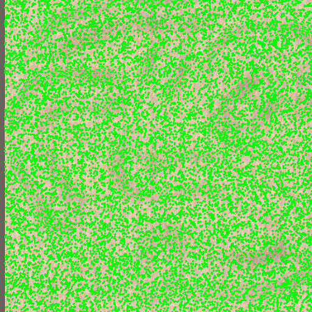
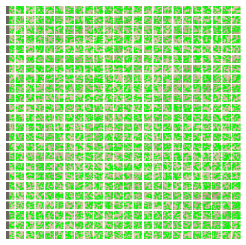
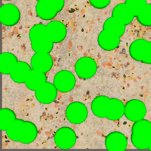

# Forest Fire Tracker(Distributed Computing)

## Introduction
This project aims to explore the issue of forest fire in a distributed manner, such that if the data is coming from multitude of cameras spread throughout the forest, how we would process such a large data stream in realtime and predict the rate of spread of fire and determine which part of the forest is most like to burn next.

You can find the presentation [here](https://docs.google.com/presentation/d/1LLqI5QP5mKQEvh4doRRyyPoVaXjJIV1GimPWcVtWH0M/edit?usp=sharing)

## Architecture
The simulation has been taken care by Unity, with image caching by Redis. Image processing has been done with the help of OpenCV in a distributed manner with firewall prediction done in Dask. Coordination between all these process, has been taken care with Kafka streaming services. The final results, has been plotted in a Dashboard, for visualization. Please refer to the following diagram for a better understanding of the architecture 

## Simulation
In order to accurately simulate a large forest, we take a 24*24 grid, each consisting of around 20-30 trees. The simulation has been done with Unity, with each box image size taken to be 256x256, resulting in overall terrain of 6144x6144 pixels. 

At a particular timestamp, a tree can be in one of the four states:
- Alive: Green
- Heating: Yellow
- Red: Burning
- Black: Dead

<!-- Plot two images side by side of one another -->

  
  

## Image Processing
We applied Image Processing algorithms such as contour detection, canny edge detection independtly on each grid i.e. on a 256x256 image to detect the tree contour and accurately determine the position within the grid. The image processing results can be seen below:

  
  

## Fire Prediction
We used Dask to predict the fire spread rate, by taking the input from the Kafka stream and then predicting the fire spread rate by factoring in the distance between the burning trees and taking a exponential of the distance. The results can be seen below:

