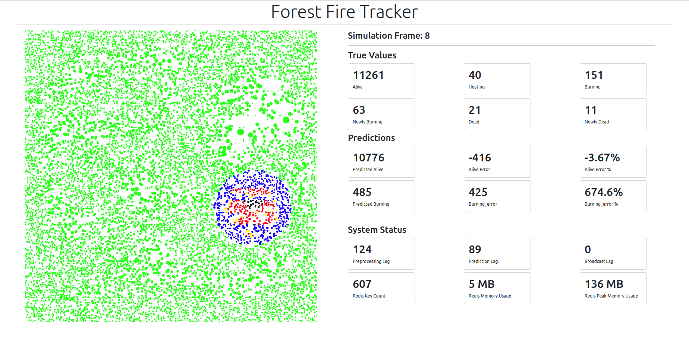
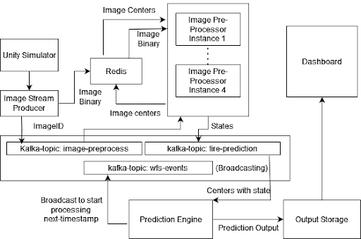
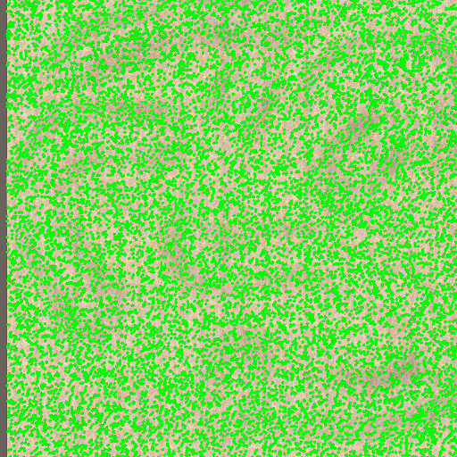
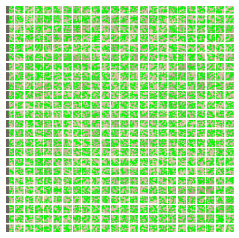
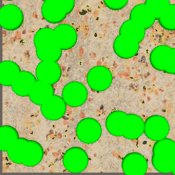
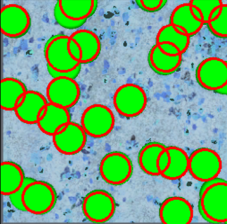

# Forest Fire Tracker (Distributed Computing)

<!-- Add an image here -->

## Introduction
The Forest Fire Tracker project aims to address the challenge of forest fires using a distributed computing approach. It focuses on real-time processing of data streams from numerous cameras spread throughout the forest. The primary goal is to predict the rate of fire spread and identify the areas of the forest most susceptible to burning.

You can access the project presentation [here](https://docs.google.com/presentation/d/1LLqI5QP5mKQEvh4doRRyyPoVaXjJIV1GimPWcVtWH0M/edit?usp=sharing).

## Architecture
The project's architecture utilizes various technologies to achieve its objectives. Unity is employed for simulation purposes, while Redis handles image caching. Image processing is accomplished through distributed OpenCV operations, and Dask is utilized for firewall prediction. Kafka streaming services facilitate coordination among these components. To gain a clearer understanding of the architecture, please refer to the following diagram:

## Simulation
To create an accurate simulation of a large forest, we employ a 24x24 grid, with each grid cell containing approximately 20-30 trees. Unity is used for implementing the simulation, with each box's image size set to 256x256 pixels, resulting in an overall terrain of 6144x6144 pixels.

At each timestamp, a tree can exist in one of four states:
- Alive (Green)
- Heating (Yellow)
- Burning (Red)
- Dead (Black)

<!-- Display two images side by side -->

  
  

## Image Processing
For accurate tree detection and positioning within each grid, we apply independent image processing algorithms, such as contour detection and canny edge detection, to each 256x256 grid cell. This enables us to identify tree contours effectively. The image processing results are depicted below:

  
  

## Fire Prediction
To predict the rate of fire spread, we utilize Dask to process input from the Kafka stream. By considering the distance between burning trees and applying an exponential function to this distance, we can estimate the fire spread rate. The results are shown at the top if the file.